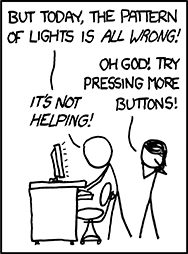

<style>
details {
	border-top: 1px solid #aaaaaa;
	height: 100vh;
}

summary {
	margin-bottom: 50px;
	padding-top: 50px;
}

details * {
	font-size: 24px;
	line-height: 36px;
}
</style>


<details>
<summary>What is this?</summary>


</details>


<details>
<summary>Story time</summary>

> "Make a card flip over"
</details>


<details>
<summary>What we're talking about</summary>

Design for non-designers

aka doing the least

to create an experience
</details>


<details>
<summary>A picture of a guy throwing pieces of bread to a duck in a pond</summary>


How do you know it's a picture of a guy throwing pieces of bread to a duck in a pond?
</details>


<details>
<summary>Method 1</summary>

> Labeling
</details>


<details>
<summary>Case study</summary>

Craigslist
</details>


<details>
<summary>What is this?</summary>


</details>


<details>
<summary>Method 2</summary>

> Skeuomorphism

Faking real-world things

Doesn't take much
</details>


<details>
<summary>Also button</summary>

What makes this more button-y?


</details>


<details>
<summary>More real ≠ better</summary>

Sweet graph:

```
Abstract <----- OK! ----- Creepy -----> Realistic
```
</details>


<details>
<summary>Consider the face of Google</summary>


From Material Icons
</details>


<details>
<summary>Now consider Andy</summary>


</details>


<details>
<summary>Artists are lazy too</summary>

What is this?

Hint: You've seen it in a zillion pieces of art


</details>


<details>
<summary>You don't need the rest</summary>


</details>


<details>
<summary>Even 4 year-olds get this</summary>

- Smiley faces
- Stick figures
- Water
- Birds
</details>


<details>
<summary>Trust your users to fill in the blanks</summary>


</details>


<details>
<summary>Computers are illusions</summary>

What's behind Mario?


</details>

<details>
<summary>In conclusion</summary>


</details>
